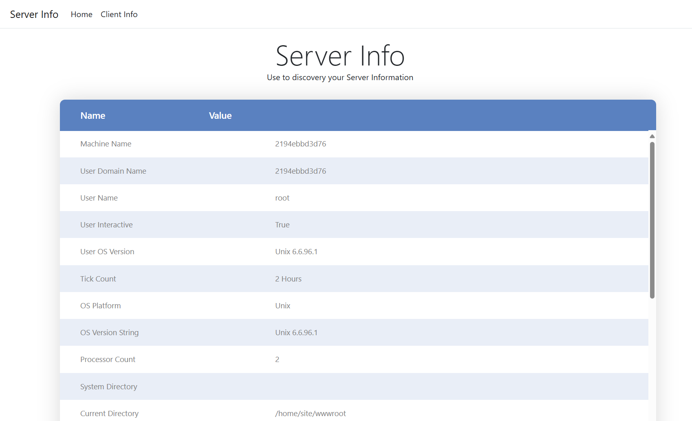
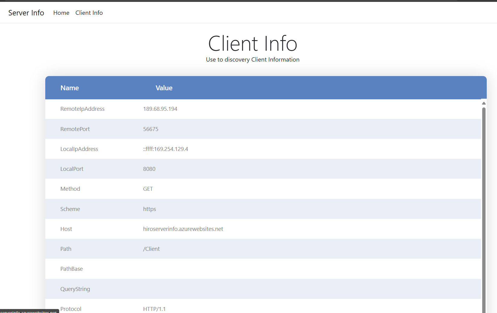
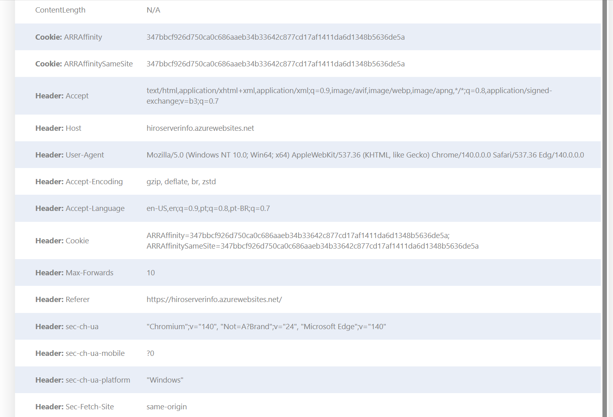

 
 
[](https://azure.microsoft.com)


# Server Info

- Have you ever needed a tool that exposes some information of the request client? (What headers is comming to server, what client IP, in witch header?)
- Have you ever needed a tool that exposes some enviroment variable that application is considering, in a non-develop environment?
- Have you ever be curious what developer have the information to use in thier applicatons?

This application exposes Server and Client request details available in code (dotnet).

Usefull to IT Admins to know details of environment, mainly in diferent contexts, such as contaniner environment.

Usefull to developers in development time to know the environment virables and other informations about destination environment.

> [!IMPORTANT]
> This is a debugging tool. Not recommended to leave on production environments with public access.

This is the portable version to run standalone, or in a Docker container.

## Pre-Requisites

To run the project locally, you'll need to make sure the following tools are installed:

- [.NET 9](https://dotnet.microsoft.com/downloads/)
- [Git](https://git-scm.com/downloads)
- [Azure Developer CLI (azd)](https://aka.ms/install-azd)
- [Visual Studio Code](https://code.visualstudio.com/Download) or [Visual Studio](https://visualstudio.microsoft.com/downloads/)
  - If using Visual Studio Code, install the [C# Dev Kit](https://marketplace.visualstudio.com/items?itemName=ms-dotnettools.csdevkit)

### Run the solution

Follow these steps to run the project locally

- Open your terminal
- Navigate to your repos folder

- Clone repository:

  ```bash
  git clone https://github.com/microsoft/Server-Info.git
  ```

- Navigate to cloned folder

  ```bash
  cd Server-info/Server-info
  ```

- Run the project:

  ```bash
  dotnet run
  ````

## Overview

<br/>

- The home site exposes information about your infrastructure in a clean and very easy table. 

<br/>



<br/>

- Client tab exposes information about client (browser) that is accessing the site, as well some client informations that is available in code.

<br/>



- To see header information, scroll down to see more information about client request


## Contributing

This project welcomes contributions and suggestions.  Most contributions require you to agree to a
Contributor License Agreement (CLA) declaring that you have the right to, and actually do, grant us
the rights to use your contribution. For details, visit https://cla.opensource.microsoft.com.

When you submit a pull request, a CLA bot will automatically determine whether you need to provide
a CLA and decorate the PR appropriately (e.g., status check, comment). Simply follow the instructions
provided by the bot. You will only need to do this once across all repos using our CLA.

This project has adopted the [Microsoft Open Source Code of Conduct](https://opensource.microsoft.com/codeofconduct/).
For more information see the [Code of Conduct FAQ](https://opensource.microsoft.com/codeofconduct/faq/) or
contact [opencode@microsoft.com](mailto:opencode@microsoft.com) with any additional questions or comments.

## Trademarks

This project may contain trademarks or logos for projects, products, or services. Authorized use of Microsoft 
trademarks or logos is subject to and must follow 
[Microsoft's Trademark & Brand Guidelines](https://www.microsoft.com/en-us/legal/intellectualproperty/trademarks/usage/general).
Use of Microsoft trademarks or logos in modified versions of this project must not cause confusion or imply Microsoft sponsorship.
Any use of third-party trademarks or logos are subject to those third-party's policies.
